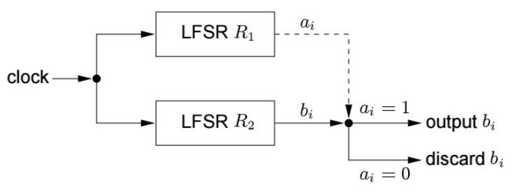
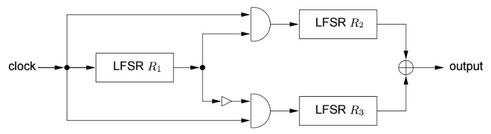

# RunOnMachine — LFSR / FSM scripts

This folder contains standalone Python scripts used to run small LFSR / FSM exercises locally (no frontend required).
The short examples below show the important outputs for each exercise (periods, LFSR outputs and first FSM bits) so readers can quickly verify results without re-running everything.

---

## Contents

```
RunOnMachine/
  ├─ FSM2LSFROnMachine.py    # EXO 1 — FSM from 2 LFSRs
  ├─ FSM3LSFROnMachine.py    # EXO 4 — FSM from 3 LFSRs
  ├─ LFSRwordDeCipher.py     # EXO 5 — word deciphering using 5 key candidates
  ├─ FSMex01.txt             # printed output from EXO 1 script
  ├─ FSMex04.txt             # printed output from EXO 4 script
  └─ README.md               # (this file)
```

---

## How to run

From the repository root:

```bash
cd SecurityRM/RunOnMachine
python3 FSM2LSFROnMachine.py   # runs EXO1 (2-LFSR FSM)
python3 FSM3LSFROnMachine.py   # runs EXO4 (3-LFSR FSM)
python3 LFSRwordDeCipher.py    # runs EXO5 (word decipher)
```

---

## EXO 1 — 2-LFSR FSM (short description)

**What the exercise is:** combine two LFSRs (R1 controls whether R2 output is used) to form a FSM keystream generator.

### **FSM Architecture — EXO 1**

<p align="center">
  
</p>

**Short summary of outputs (from script):**

```
=== RUNNING LFSRs ===

R1 period: 7
R1 outputs: [1, 0, 0, 1, 1, 1, 0]


R2 period: 31
R2 outputs: [1, 0, 1, 0, 0, 0, 0, 1, 0, 0, 1, 0, 1, 1, 0, 0, 1, 1, 1, 1, 1, 0, 0, 0, 1, 1, 0, 1, 1, 1, 0]

=== RUNNING FSM (2 LFSRs) ===

FSM output length: 124
First 25 FSM bits: [1, 0, 0, 0, 1, 1, 0, 1, 0, 1, 1, 1, 0, 1, 1, 0, 1, 1, 0, 1, 0, 1, 0, 0, 0]
```

`EXO1.txt` is the file that contains **what the script prints on the console**.

`FSMex01.txt` contains **the final FSM output bits** for Exercise 1.

---

## EXO 4 — 3-LFSR FSM (short description)

**What the exercise is:** alternating-step FSM using three LFSRs (R1 always clocked; R1 decides whether R2 or R3 advances). Output bit is XOR of R2 and R3 outputs. See the PDF for the full statement and formulas. 

### **FSM Architecture — EXO 4**

<p align="center">
  
</p>

**Short summary of outputs (from script):**

```
=== RUNNING LFSRs ===

R1 period: 7
R1 outputs: [1, 0, 0, 1, 1, 1, 0]

R2 period: 3
R2 outputs: [1, 1, 0]

R3 period: 31
R3 outputs: [1, 0, 0, 1, 0, 0, 1, 1, 1, 1, 1, 0, 1, 1, 1, 0, 0, 0, 1, 0, 1, 0, 1, 1, 0, 1, 0, 0, 0, 0, 1]

=== RUNNING FSM ===

FSM stats:
  steps : 651
  ones  : 323
  zeros : 328

FSM output (first ~25 bits):
[1, 0, 1, 1, 0, 1, 1, 1, 0, 1, 0, 1, 1, 1, 0, 1, 1, 0, 0, 1, 1, 0, 0, 0, 0, ...]
```

`EXO4.txt` is the file that contains **what the script prints on the console** .

`FSMex04.txt` contains **the final FSM output bits** for Exercise 4.


---

## EXO 5 — Text deciphering with multiple keys (short description)

**What the exercise is:** an LFSR produced a 15-bit repeating pattern that was used as a key stream. Five candidate key shifts were tested; the script expands each candidate to 70 bits, XORs with ciphertext, converts 5-bit blocks to letters, and scores decoded text against a French dictionary to find the most plausible plaintext. 

**Script & outputs (short):**

Script: `LFSRwordDeCipher.py` (stored in this folder)
Printed summary (trimmed to main results):

```
Key1: OQ?I?YPPX???J?    (score=0)
Key2: QUEWYCRLNE?BXY    (score=6)
Key3: M?RKRXNCYYXULR    (score=0)
Key4: UO?SC?VRTAE?TC    (score=0)
Key5: FINDELEXERCICE    (score=17)

Best key: 5
Decoded text: FINDELEXERCICE
Score: 17
```
`EXO5.txt` is the file that contains **what the script prints on the console** .

---


